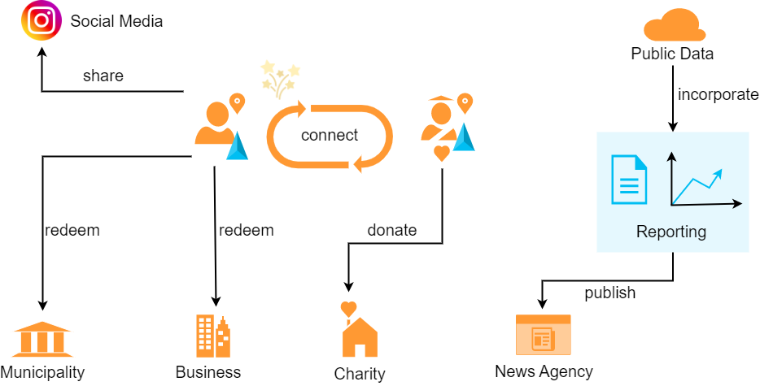
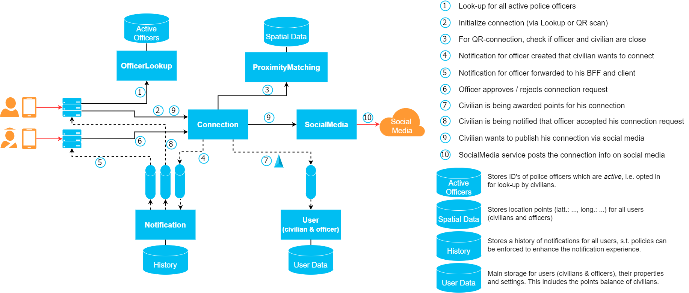

# 2022-fall-architectural-katas
Public repository to upload deliverables for O'Reillys 2022 Fall Architectural Katas

## Team IPT
Team IPT consists of [Matthäus Heer](https://ipt.ch/de/team/mitarbeiter/matthaus-heer), [Nicolas Mesot](https://ipt.ch/de/team/mitarbeiter/nicolas-mesot) and [Max Riedel](https://ipt.ch/de/team/mitarbeiter/max-riedel). We all are IT Consultants with [Innovation Process Technology AG](https://ipt.ch) in Zurich, Switzerland.

## Requirements
The following overview exhibits all actors participating in the system with their main intentions and capabilities.
More specifics can be found in the functional requirements section below.

We grouped the requirements for the **Hey, Blue!** application into the following two sections.  
- [Functional requirements](requirements/functional-requirements.md)
- [Non-functional requirements](requirements/non-functional-requirements.md)  

While the former explains the desired functionalities of the application, describing possible user interactions, the former
represents a set of technical guidelines the system has to adhere to.

## Context
In the following we will describe what actors (can be a user, participant or system) might interact in what way with the **Hey, Blue!** system.
For that matter, the diagram displays the main capabilities or intentions a user or system has to its disposal. 

The actors are being divided into internal, i.e. actors which are internal to the **Hey, Blue!** ecosystem and external actors,
e.g., civilians and officers using the application. That way we receive a clear picture who profits from this ecosystem
and what the intends and desires of those actors might be.

## Domain Design
### Event-Storming process
How we did that stuff...

### Domain capabilities
The fields we came up with using event storming to form micro-service landscapes...

TODO: Overview of complete architecture.

Now we add the sub-architectures.

#### Connection capability
The connection capability describes the micro-service landscape enabling civilians and officers to make a 
connection incl. all the processes around this central happening. The capability is described in more detail
here: [Connection Capability](domain/connection-capability.md).

#### Reporting capability

The reporting capability covers the service landscape enabling Hey, Blue! staff to generate reports and share them with 
media companies. More information can be found here:  [Reporting Capability](domain/reporting-capability.md)

#### Order capability
The order capability describes the service landscape enabling Civilians or Charities to redeem their points. For more details see [Order Capability](domain/order-capability.md).

#### User
TODO

## Service Architecture
TODO: Describe clean architecture with Connection Service example.

## System Architecture
TODO: Add Azure Cloud Architecture with ADR why Azure und ADRs for decisions.
