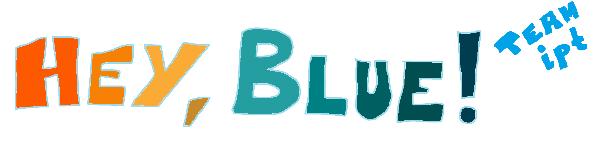
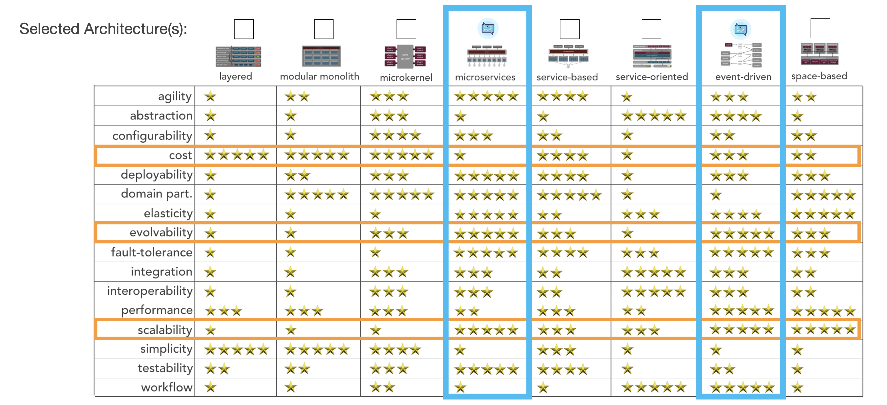
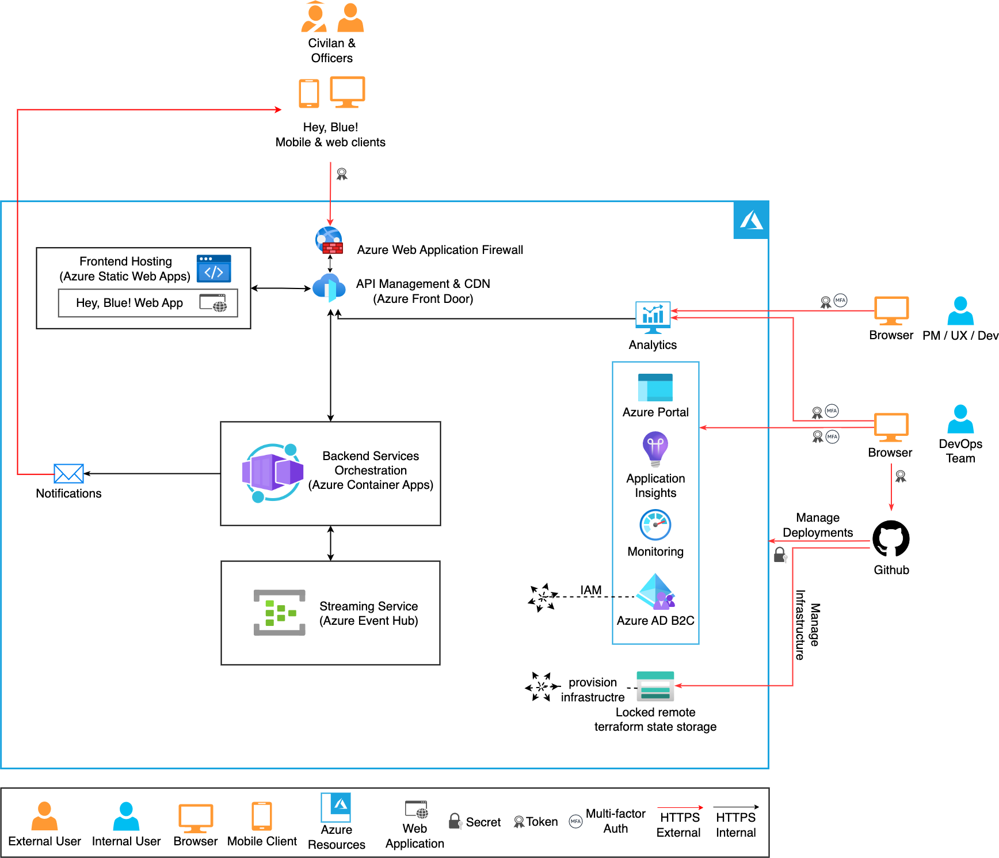

# 2022-fall-architectural-katas

This work represents our contribution to the Fall 2022 Architectural Katas hosted by [O'Reilly](https://learning.oreilly.com/home/). We seek to develop a software architecture for the [**Hey, Blue!**](https://www.verdiecoschool.org/heyblue) initiative. It's mission is establish connections among police officers and community members who sharing a common purpose. Hey, Blue! has been brought to live by [John Verdi](https://www.verdiecoschool.org/ourteam), a  retired law enforcement officer from NYC and 9/11 first responder.

## Content

<table border="0">

 <tr style="vertical-align:top">
    <td>

**[1. Wo we are](#who-we-are)**

**[2. Problem Statement](#problem-background)**
* [2.1. Hey, Blue! Vision](#hey-blue-vision)
* [2.2. Requirements](#requirements)
* [2.3. Actors Overview](#actors-overview)

**[3. Domain Design](#domain-design)**
* [3.1. Event Storming Process](#event-storming-process)
* [3.2. Architecture Style](#architecture-style)
* [3.3. Domain capabilities](#domain-capabilities)
    * [3.3.1 Connection Capability](domain/connection-capability.md)
    * [3.3.2 Reporting Capability](domain/reporting-capability.md)
    * [3.3.3 Order Capability](domain/order-capability.md)
    * [3.3.4 User Capability](domain/user-capability.md)
* [3.4. Legend](#legend)
    </td>
    <td>
**[4. System Architecture](#system-architecture)**
* [4.1. System Architecture Document](azure/resources/cloud-architecture.md)

**[5. Architecture Decision Records (ADR)](#architecture-decision-records-adr)**
* [5.1. ADR01 Microservice Architecture](adrs/01-microservice-architecture.md)
* [5.1. ADR02 Backend-for-Frontend Pattern](adrs/02-bff.md)
* [5.1. ADR03 Points Redemption Framework](adrs/03-redeem-points.md)
* [5.1. ADR04 Dispatcher Architecture](adrs/04-dispatcher-architecture.md)
* [5.1. ADR05 Read Replica Pattern](adrs/05-read-replica-pattern.md)
* [5.1. ADR06 GDPR Compliance](adrs/06-GDPR-compliance.md)
* [5.1. ADR07 Azure as a Hyperscaler](adrs/07-azure-hyperscaler.md)
* [5.1. ADR08 Event-Driven Design](adrs/08-event-driven-design.md)

**[6. Acknowledgements](#acknowledgements)**
    </td>
 </tr>
</table>

## Who we are
Our team *IPT* consists of [Matthäus Heer](https://ipt.ch/de/team/mitarbeiter/matthaus-heer), [Nicolas Mesot](https://ipt.ch/de/team/mitarbeiter/nicolas-mesot) and [Max Riedel](https://ipt.ch/de/team/mitarbeiter/max-riedel). We are IT Consultants with [Innovation Process Technology AG](https://ipt.ch) 🚀 in Zurich, Switzerland. Our goal is to make technology valuable. Thus, we put our ❤️ into *IT*.

## Problem Background

### Hey, Blue! Vision
During 9/11 [EcoSchool](https://www.verdiecoschool.org/) founder and 9/11 first responder John Verdi experienced the collaborative acts of heroism by first responders and civilians. That inspired him to start [**Hey, Blue!**](https://www.verdiecoschool.org/heyblue), an initiative to facilitate moments of meaningful connection between police officers and members of their community.

**Hey, Blue!** is used to incentivize police officers and civilians to meet and share their positive connection with other community members. The initiatives target is to have police officers across the United States connect with 5 civilians each day, which would lead to 1.2 billion connections each year. Both the officer and the civilian are granted points for their positive connection. Officers can donate their points to charities. Civilians and charities can redeem their points in exchange for goods or discounts from participating local businesses.

### Requirements
We grouped the requirements for the **Hey, Blue!** application into the following two sections.  
- [Functional requirements](requirements/functional-requirements.md)
- [Non-functional requirements](requirements/non-functional-requirements.md) 
### Actors Overview
The following overview exhibits all actors participating in the **Hey, Blue!** ecosystem with their main intentions and capabilities.
More specifics can be found in the [Functional requirements](requirements/functional-requirements.md) section as well as the [Context](#context) section.

For a legend refer to the section [Domain Design](#domain-design).

While the former explains the desired functionalities of the application, describing possible user interactions, the latter
represents a set of technical guidelines the system has to adhere to.

### Context
In the following, we will describe what actors (can be a user, participant or system) might interact in what way with the **Hey, Blue!** system.
For that matter, the diagram displays the main capabilities or intentions a user or system has to its disposal. 

The actors are being divided into internal, i.e. actors which are internal to the **Hey, Blue!** ecosystem and external actors,
e.g., civilians and officers using the application. That way we receive a clear picture who profits from this ecosystem
and what the intends and desires of those actors might be.

## Domain Design
Now that all the actors and intents in the system are well understood, it's time to map these requirements into domain model which defines a common terminology and crystallizes out lower level components of the domain landscape. These components are grouped into so-called capabilities which form the basis for the final software architecture based on microservices. 
We tackle this challenge by employing [Domain Driven Design](https://en.wikipedia.org/wiki/Domain-driven_design). This approach enables us to subdivide the overarching problem statement into meaningful sub-domains based on business requirements and come up with a scalable, modularized and extensible software architecture.

### Event-Storming process
[Event Storming](https://www.eventstorming.com/) is a technique to develop a common understanding of all 
involved stakeholders, that is, domain experts, managers and the development team, of the domain at hand. 

Learn more about our approach in the **[Event Storming Subpage](eventstorming/event-storming.md)**.

The following picture shows the final state of the Event Storming session. Note the overarching capabilities (green stickers) which we distilled out of the domain landscape which then became the foundational [domain capabilities](#domain-capabilities) for our microservice architecture. 

### Architecture Style
We used the Architecture Styles Worksheet from Mark Richards [website](https://www.developertoarchitect.com/downloads/worksheets.html) to make an informed decision on the architecture style of **Hey, Blue!**. As shown in the matrix below and as stated in [System Characteristics](requirements/non-functional-requirements.md) we identified Feasability (cost), Evolvability and  Scalability as our main characteristics to base our decision on. 

Though costs may be higher, we decided to go for a microservice architecture style with event-driven elements in it (see [ADR01 Microservice Architecture](ADRs/01-microservice-architecture.md) and [ADR08 Event-Driven Design](ADRs/08-event-driven-design.md)). With this we can best guarantee that **Hey, Blue!** can scale and adapt accordingly to the users needs, and is so best setup for success. Monolithic options, which usually are cheaper to develop, won't be able to hold up with the pace in which a social network can evolve.

### Domain capabilities
Based on the output of the Event Storming, we defined the following capabilities for each of which we developed a microservice architecture.

#### Capabilities Overview
The following diagram gives a high-level overview of how the capabilities interact with each other. Further details to each capability is found next.

<table>
<tr>
    <td style="table-layout: fixed; width: 1000px" align="center">
        <a href="domain/connection-capability.md">Connection Capability 
        </a>
        
This is the heart piece of the Hey, Blue! ecosystem enabling civilians and officers to connect. This includes the possibility for officers to enroll in the look-up for civilians such that civilians can find officers online, the actual virutal handshake itself along with the respective notifications, rewards and awarding of points. Handshakes can only happen in proximity and connections might be shared over social media.

    </td>
    <td style="table-layout: fixed; width: 1000px" align="center"> <a href="domain/reporting-capability.md">Reporting Capability 
        </a>
        
The reporting capability covers the service landscape enabling Hey, Blue! staff to generate reports and share them with media companies.

    </td>
</tr>
</table>
<table>
<tr>
    <td style="table-layout: fixed; width: 1000px" align="center"> <a href="domain/order-capability.md">Order Capability 
        </a>
        
The order capability describes the service landscape enabling Civilians or Charities to redeem their points.

    </td>
    <td style="table-layout: fixed; width: 1000px" align="center"> <a href="domain/user-capability.md">User Capability 
        </a>
        
This capability is responsible for maintaining user sessions, storing user data, registering new users and keeping track of connections between officers and civilians.

    </td>
</tr>

</table>

### Legend
For all of the above, if not stated otherwise in the diagram at hand, the symbols reflect the meaning as described in the following legend.

## System Architecture
We used a [domain-driven approach](#domain-design) to define our [service landscape](#domain-capabilities) for the 
**Hey, Blue!** ecosystem. With those capabilities at hand, we finally propose a cloud-native software solution that can 
cope with the [requirements](#requirements) and is feasible to implement for an ambitious startup corporation. 
The design embraces [DevOps](https://en.wikipedia.org/wiki/DevOps), [GitOps]() and 
[Zero Trust](https://en.wikipedia.org/wiki/Zero_trust_security_model) principles as first 
class citizens. As an exemplary cloud vendor we chose [Microsoft Azure](https://azure.microsoft.com/en-us/), however the solution
can easily be ported to other cloud platforms as described in [ADR07 Azure as a Hyperscaler](ADRs/07-azure-hyperscaler.md).

Please refer the **[system architecture document](azure/resources/cloud-architecture.md)** for further explanations.

## Architecture Decision Records (ADR)
This summary provides an overview of the ADRs we refer to in the appropriate sections above. An ADR includes the context, i.e. the problem statement, a solution space, a decision, rationale and the decisions consequences.

- [ADR01 Microservice Architecture](ADRs/01-microservice-architecture.md)
- [ADR02 Backend-for-Frontend Pattern](ADRs/02-bff.md)
- [ADR03 Points Redemption Framework](ADRs/03-redeem-points.md)
- [ADR04 Dispatcher Architecture](ADRs/04-dispatcher-architecture.md)
- [ADR05 Read Replica Pattern](ADRs/05-read-replica-pattern.md)
- [ADR06 GDPR Compliance](ADRs/06-GDPR-compliance.md)
- [ADR07 Azure as a Hyperscaler](ADRs/07-azure-hyperscaler.md)
- [ADR08 Event-Driven Design](ADRs/08-event-driven-design.md)

## Acknowledgements
We would like to thank the team behind the O'Reilly Architectural Katas and the judges for their effort in making this instructive and fun event possible. Next, we would like to thank the team of Hey, Blue! for presenting such an interesting challenge with real-world usage and positive impact for society. Finally, we would like to thank our employer, Innovation Process Technology, for giving us the opportunity to participate in this challenge and working on our architectural skills. It's been one hell of a ride.

<!--               NOTES                >

HTML IMG TEMPLATE FOR IMAGES

-->
