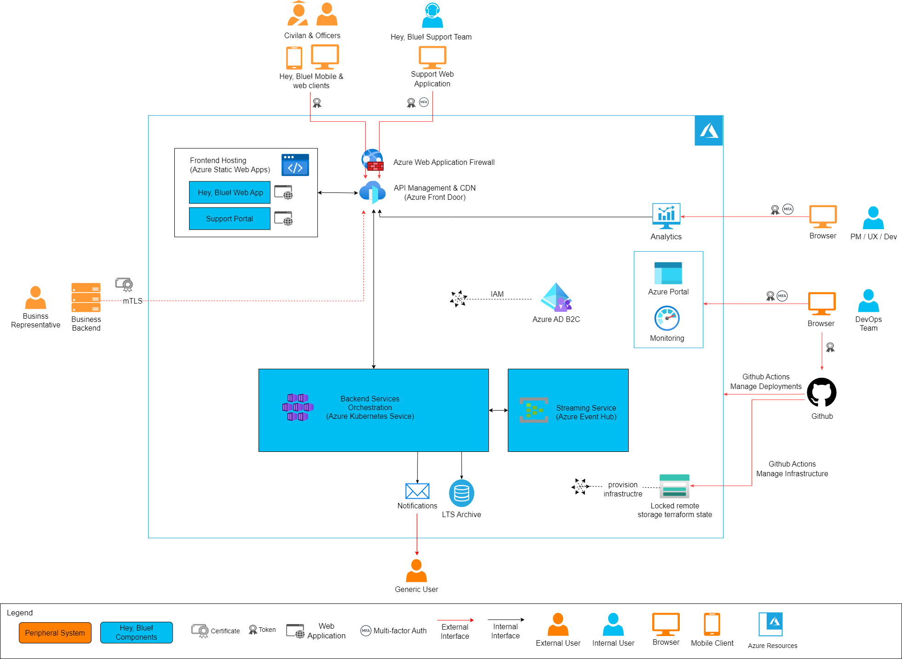

# 2022-fall-architectural-katas

The O'Reillys 2022 Fall Architectural Katas. 🤓

## Team IPT
Our IPT consists of [Matthäus Heer](https://ipt.ch/de/team/mitarbeiter/matthaus-heer), [Nicolas Mesot](https://ipt.ch/de/team/mitarbeiter/nicolas-mesot) and [Max Riedel](https://ipt.ch/de/team/mitarbeiter/max-riedel). We are IT Consultants with [Innovation Process Technology AG](https://ipt.ch) 🚀 in Zurich, Switzerland.

## Actors Overview
The following overview exhibits all actors participating in the **Hey, Blue!** ecosystem with their main intentions and capabilities.
More specifics can be found in the functional requirements section below as well as the [Context](#context) section.

For a legend refer to the section [Domain Design](#domain-design).

## Requirements
We grouped the requirements for the **Hey, Blue!** application into the following two sections.  
- [Functional requirements](requirements/functional-requirements.md)
- [Non-functional requirements](requirements/non-functional-requirements.md)  

While the former explains the desired functionalities of the application, describing possible user interactions, the latter
represents a set of technical guidelines the system has to adhere to.

## Context
In the following we will describe what actors (can be a user, participant or system) might interact in what way with the **Hey, Blue!** system.
For that matter, the diagram displays the main capabilities or intentions a user or system has to its disposal. 

The actors are being divided into internal, i.e. actors which are internal to the **Hey, Blue!** ecosystem and external actors,
e.g., civilians and officers using the application. That way we receive a clear picture who profits from this ecosystem
and what the intends and desires of those actors might be.

## Domain Design
Now that all the actors and intents in the system are well understood, it's time to map these requirements into domain model which defines a common terminology and crystallizes out lower level components of the domain landscape. These components are grouped into so-called capabilities which form the basis for the final software architecture based on microservices. 
We tackle this challenge by employing [Domain Driven Design](https://en.wikipedia.org/wiki/Domain-driven_design). This approach enables us to subdivide the overarching problem statement into meaningful sub-domains based on business requirements and come up with a scalable, modularized and extensible software architecture.

### Event-Storming process
[Event Storming](https://www.eventstorming.com/) is a technique to develop a common understanding of all 
involved stakeholders, that is, domain experts, managers and the development team, of the domain at hand. 
Read more details about our approach [here](eventstorming/event-storming.md).

### Domain capabilities
Based on the output of the Event Storming, we defined the following capabilities for each of which we developed a microservice architecture.

<table>
<tr>
    <td style="table-layout: fixed; width: 1000px" align="center">
        <a href="domain/connection-capability.md">Connection Capability 
        </a>
        
This is the heart piece of the **Hey, Blue!** ecosystem enabling civilians and officers to connect. This includes the possibility for officers to enroll in the look-up for civilians such that civilians can find officers online, the actual virutal handshake itself along with the respective notifications, rewards and awarding of points. Handshakes can only happen in proximity and connections might be shared over social media.

    </td>
    <td style="table-layout: fixed; width: 1000px" align="center"> <a href="domain/reporting-capability.md">Reporting Capability 
        </a>
        
The reporting capability covers the service landscape enabling **Hey, Blue!** staff to generate reports and share them with media companies.

    </td>
</tr>
<tr>
    <td style="table-layout: fixed; width: 1000px" align="center"> <a href="domain/order-capability.md">Order Capability 
        </a>
        
The order capability describes the service landscape enabling Civilians or Charities to redeem their points.

    </td>
    <td style="table-layout: fixed; width: 1000px" align="center"> <a href="domain/user-capability.md">User Capability 
        </a>
        
This capability is responsible for maintaining user sessions, storing user data, registering new users and keeping track of connections between officers and civilians.

    </td>
</tr>

</table>

For all of the above, if not stated otherwise in the diagram at hand, the symbols reflect the meaning as described in the following legend.

## System Architecture
For the reasons described in [ADR07 Azure as a Hyperscaler](ADRs/07-azure-hyperscaler.md), we opted for Microsoft Azure as an examplary public hyperscaler to host the **Hey, Blue!** application. The following drawing unveils how the cloud architecture might look like on this platform. We took care to separate out internal (i.e. components hosted on Azure and controlled by **Hey, Blue!**) and external/peripheral systems and what security mechanisms protect the system.
Note that the business backend on the left side is a possible extension to enable business to upload or sync offerings directly via an API rather than through the **Hey, Blue!** portal.

## Architecture Decision Records (ADR) Overview
This summary provides an overview of the ADRs we refer to in the appropriate sections above. An ADR includes the context, i.e. the problem statement, a solution space, a decision, rationale and the decisions consequences.

- [ADR01 Microservice Architecture](ADRs/01-microservice-architecture.md)
- [ADR02 Backend-for-Frontend Pattern](ADRs/02-bff.md)
- [ADR03 Points Redemption Framework](ADRs/03-redeem-points.md)
- [ADR04 Dispatcher Architecture](ADRs/04-dispatcher-architecture.md)
- [ADR05 Read Replica Pattern](ADRs/05-read-replica-pattern.md)
- [ADR06 GDPR Compliance](ADRs/06-GDPR-compliance.md)
- [ADR07 Azure as a Hyperscaler](ADRs/07-azure-hyperscaler.md)

<!--               NOTES                >

HTML IMG TEMPLATE FOR IMAGES

-->
