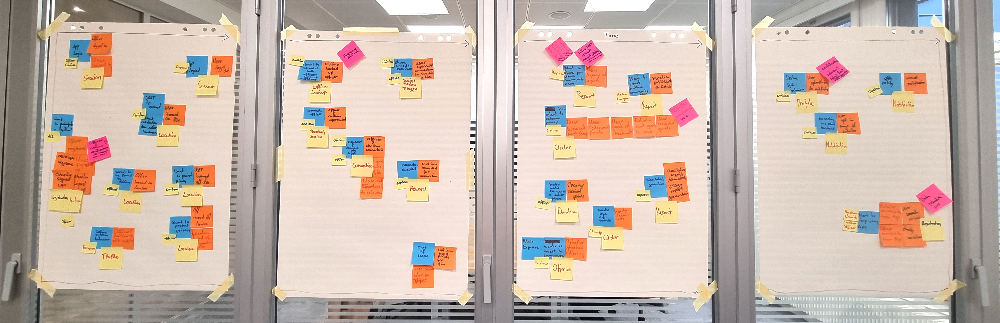
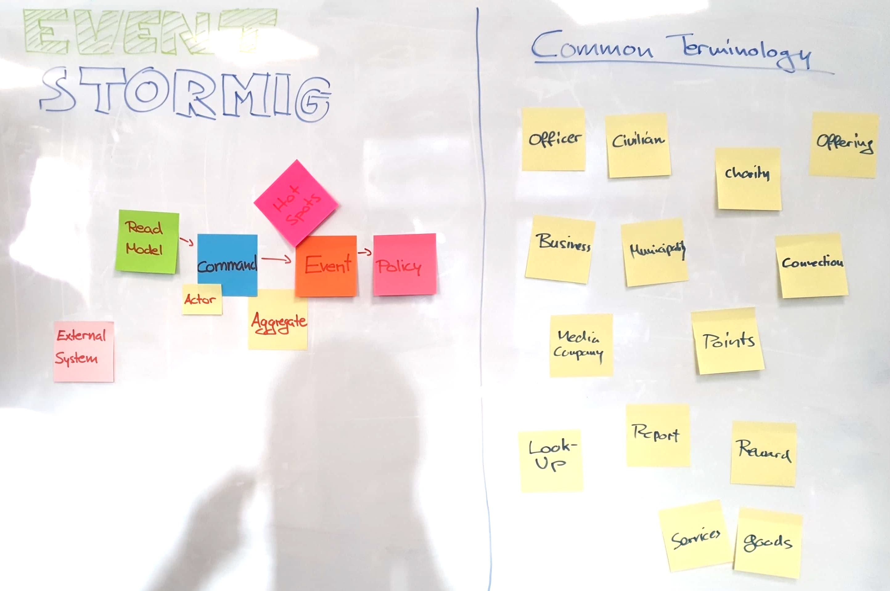

# Event Storming

[Event Storming](https://www.eventstorming.com/) is a technique to develop a common understanding of all
involved stakeholders, that is, domain experts, managers and the development team, of the domain at hand.
Although we did not have the chance to collaborate with dother domain experts outside our team, 
we still found value in going through the process of Event Storming. We ended up
with a deeper understanding of the Hey, Blue! domain and understood how to map
the functional requirements into capabilities, services and components. We believe that a
thorough understanding of the domain to model inside an application is vital for designing
a highly capable software system.

## Event-Storming process
In the following we describe our approach to the Event Storming session step-by-step. This 
proceeding agrees with the common methodics of Event Storming.

---
1) To kick things off, we reviewed the process itself and agreed on a rough timeline for
the following sections.
2) First, we identified the major events taking place in the system due to some actor's interactions (orange stickers).
3) We placed the actor (small yellow stickers) along with the intent for the action (blue stickers) next to the event.
4) Those Actor-Command-Event groupings would be combined to meaningful Aggregates (large yellow stickers), which are logical entities making up the domain model.
5) We identified hot spots (dark pink stickers) or open questions and resolved those during discussions.
6) External systems (light pink stickers) have been added to complete the picture.
7) We regrouped all the aggregates into logical system capabilities (green stickers). 
Subsequently, for each capabilitiy (e.g. "Connection", that is all the components involved in a civilian and an officer performing a digital handshake, a connection) a microservice landscape has been developed.
--- 

The following images show different stages throughout the process.

State after stage 3). Events, actors and intents have been identified.

State after stage 5). The building blocks of the domain, Aggregates have emerged.

Final state after stage 7). The following picture shows the final state of the Event Storming session after re-grouping Aggregates and extracting capabilities. The distilled Aggregates emerge prominently in the final architecture representing the commonly developed terminology and understanding of the domain.

## Domain Terminology - Glossary

Throughout the process of Event Storming, we developed what Eric Evans, author of the fundamental
work [Doamin Driven Design](https://www.oreilly.com/library/view/domain-driven-design-tackling/0321125215/),
calls the _Ubiquitous Language_. This can be seen as a glossary of terms and their explanation which
should be used by all members involved in creating a particular software system. It helped us
comunicating and thinking more clearly about the domain by relying on a common understanding that
has emerged out of the Event Storming sessions.

The left side of the following image shows the building blocks used throughout the Event Storming
session while on the right one can see stickers forming the _Ubiquitous Language_.

The terms of the _Ubiquitous Language_ are defined below and are used throughout this proposal.
- **Officer**: Member of the police force, together with *Civilians* they form the group of *Users*.
- **Civilian**: Individual who is not an *Officer* and might connect with officers.
- **User**: *Officers* and *Civilians*.
- **Charity**: Any non-profit (NPO) private sector entity to which *Users* can donate *Points*.
- **Offering**: Commitment of *Businesses* and *Municipalities* to donate *Rewards* for certain amounts of *Points*.
- **Business**: Private sector entity which publishes *Offerings* on the **Hey, Blue!** app.
- **Municipality**: Public sector entity which publishes *Offerings* on the **Hey, Blue!** app.
- **Connection**: Central building block of the **Hey, Blue!** app. A *Connection* always happens between one *Officer* and one *Civilian*.
- **Media Company**: Third Party to which regular reports are sent for dissemination to the public.
- **Points**: In-App currency obtained by forming *Connections*. Can be exchanged for *Rewards*.
- **Look-Up**: The process of a *Civilian* checking whether *Officers* are in his vicinity.
- **Report**: Statistics and usage data showcasing the positive impact of **Hey, Blue!** on the community.
- **Reward**: Goods and Services which can be exchanged for points. Provided by *Businesses* and *Municipalities*.
