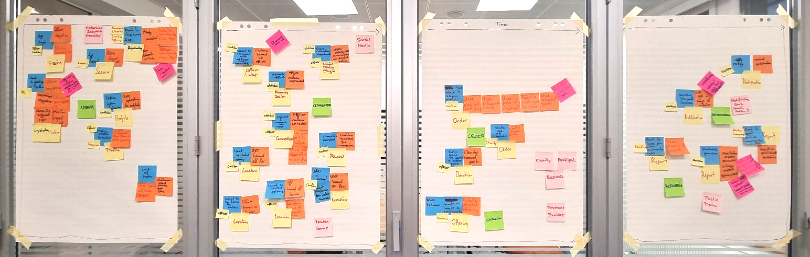

# Event Storming

[Event Storming](https://www.eventstorming.com/) is a technique to develop a common understanding of all
involved stakeholders, that is, domain experts, managers and the development team, of the domain at hand.
This was our approach:

## Event-Storming process
- First we identified the major events taking place in the system due to some actor's interactions (orange stickers).
- We placed the actor (small yellow stickers) along with the intent for the action (blue stickers) next to the event.
- Those Actor-Command-Event groupings would be combined to meaningful Aggregates (large yellow stickers), which are logical entities making up the domain model.
- We identified hot spots (dark pink stickers) or open questions and resolved those during discussions.
- External systems (light pink stickers) have been added.
- We regrouped all the aggregates into logical system capabilities (green stickers). For each capabilitiy (e.g. "Connection", that is all the components involved in a civilian and an officer performing a digital handshake, a connection) a microservice landscape has been developed (see [Domain capabilities](#domain-capabilities)).

The following picture shows the final state of the Event Storming session after re-grouping Aggregates and extracting capabilities. The distilled Aggregates emerge prominently in the final architecture representing the commonly developed terminology and understanding of the domain.

## Domain Terminology - Glossary

Event Storming lets everyone develop a common understanding. Part of this is defining domain terminology specific
to our use case. When used in this proposal, the terms below are defined as follows:
- **Officer**: Member of the police force, together with *Civilians* they form the group of *Users*.
- **Civilian**: Individual who is not an *Officer*.
- **User**: *Officers* and *Civilians*.
- **Charity**: Any private sector entity to which *Users* can donate *Points*.
- **Offering**: Commitment of *Businesses* and *Municipalities* to donate *Rewards* for certain amounts of *Points*.
- **Business**: Private sector entity which publishes *Offerings* on the **Hey, blue!** app.
- **Municipality**: Public sector entity which publishes *Offerings* on the **Hey, blue!** app.
- **Connection**: Central building block of the **Hey, blue!** app. A *Connection* always happens between one *Officer* and one *Civilian*.
- **Media Company**: Third Party to which regular reports are sent for dissemination to the public.
- **Points**: In-App currency obtained by forming *Connections*. Can be exchanged for *Rewards*.
- **Look-Up**: The process of a *Civilian* checking whether *Officers* are in his vicinity.
- **Report**: Statistics and usage data showcasing the positive impact of **Hey, blue!** on the community.
- **Reward**: Goods and Services which can be exchanged for points. Provided by *Businesses* and *Municipalities*.